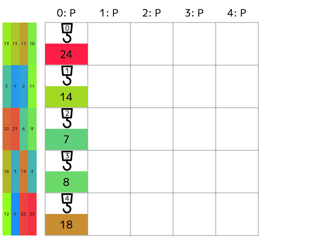

# [AHC033](https://atcoder.jp/contests/ahc033)

## Test many cases

The `runall.rb` file let you run your code for all (default) 100 input cases
and write all scores to the `out.txt` file.

## Algorithm

我が母国語たる日本語: [コード内コメント](https://github.com/yammmt/ahc-public/blob/main/ahc033/src/bin/a.rs#L162-L190)



The score of the GIF animation above is **160**.
And the average score of 100 sample cases is around **142**,
almost the same as median.

### Initialization

Try two patterns at *random*.
In the following initialize patterns figure, `x` represents a container
and `.` represents empty.

```text
xxxx.
xxxx.
xxxx.
xxxx.
xxxx.
```

```text
xxxx.
.....
xxxx.
.....
xxxx.
```

The former one is good because in almost all cases, 4x4 containers contain
the one to be completed first.
On the other hand, tha latter one has advantages in the operations of small
containers: they can move more easily.

### Num of small containers

My code uses at least 2 small cranes because it works well in my local environment.

Containers to be removed are decided at *random*.

### Move priorities

The move priorities are:

- Move the container to the correct goal
- Move the container at the left edge to another space to get the next container
- Move the container that might be required for the goal in the near future
- Move at *random*

#### Use only shortest path

My algorithm uses shortest paths only.

Using the second shortest path means that we have to pay two penalty turns.

#### When lifting crane couldn't move

Drop container and **move twice at random**.
This random move is needed because without it, the crane will **immediately**
lift the same container and block all other container's move.

### Random

Since my algorithm/strategy involves randomness, I repeat the above process for
as long as possible (2990 ms in release build).

## What I failed

The following algorithm didn't work well: invited worse scores.
It *could* be because of my poor coding skills (bug) ...

### Simulated Annealing

I attempted to apply simulated annealing to path selection but failed.

<details>
<summary>Large diff is collapsed</summary>

```diff
--- a/ahc033/src/bin/a.rs
+++ b/ahc033/src/bin/a.rs
@@ -21,8 +21,11 @@ const GRID_SIZE: usize = 5;
 const CRANE_NUM: usize = 5;
 const CONTAINER_NUM: usize = 25;
 // サンプルケース見る限りでは, 答えは最大でも 230 かそこらには収まる
+// 悪ケースで弾かれないため, マージンを取っておく
 const TURN_MAX: usize = 250;
 const RUN_TIME_MAX_MS: u64 = if cfg!(debug_assertions) { 500 } else { 2990 };
+// 焼きなまし法に用いる最大ターン, 想定する理想解の上限付近
+const TURN_MAX_SA: usize = 200;
 
 #[derive(Clone, Copy, Debug, Eq, PartialEq)]
 enum BoardStatus {
@@ -133,6 +136,11 @@ impl CraneMove {
     }
 }
 
+// 焼きなまし法の遷移確率
+fn prob(new_score: f32, pre_score: f32, now_time: f32) -> f32 {
+    ((new_score - pre_score) / now_time).exp()
+}
+
 fn main() {
     let start_time = Instant::now();
     let break_time = Duration::from_millis(RUN_TIME_MAX_MS);
@@ -667,6 +675,29 @@ fn main() {
 
                         candidates.sort_unstable_by(|a, b| a.1.len().cmp(&b.1.len()));
                         debug!("    {:?}", candidates);
+                        // 焼きなましもどきでどの手を使うかを決める
+                        // 評価値としてパスの長さを使う,
+                        // ゴールや一時置きパスに運ぶ分ではないので長さだけ
+                        // スコア:
+                        //   - 最短経路選択時には必ず遷移させるため, new_score > pre_score
+                        //   - 最短経路以外選択時には遷移確率は 1 を切る, new_score < pre_score
+                        //   - (max-cur) - (max-min) + 1 で最短選択時には 1 が保証できる
+                        //       - cur > min 時には min-cur+1 となり負数
+                        let path_len_max = candidates.last().unwrap().1.len() as f32;
+                        let path_len_min = candidates.first().unwrap().1.len() as f32;
+                        loop {
+                            let cur_i = rng.gen::<usize>() % candidates.len();
+                            let pre_score = 0f32;
+                            let new_score = (path_len_max - candidates[cur_i].1.len() as f32)
+                                - (path_len_max - path_len_min)
+                                + 1.0;
+                            let now_time = turn_cur.min(TURN_MAX_SA) as f32 / TURN_MAX_SA as f32;
+
+                            if prob(new_score, pre_score, now_time) >= rng.gen_range(0.0..=1.0) {
+                                break;
+                            }
+                        }
+
                         if containers[candidates[0].0] != ContainerStatus::Free {
                             if cranes[i].is_big() {
                                 ans[i].push(CraneMove::Wait.to_ans());
```

</details>

### Another init pattern

The following `code` block shows another init pattern:

```text
.....
xxxx.
.....
xxxx.
.....
```

### Priority of large crane

I think the large crane should handle containers that only it can lift.

<details>
<summary>Large diff is collapsed again</summary>

```diff
--- a/ahc033/src/bin/a.rs
+++ b/ahc033/src/bin/a.rs
@@ -665,7 +665,48 @@ fn main() {
                             continue;
                         }
 
-                        candidates.sort_unstable_by(|a, b| a.1.len().cmp(&b.1.len()));
+                        if cranes[i].is_big() {
+                            // 大クレーンはコンテナを飛び越えられそうなルートを優先する
+                            // 各目標ごとの最短経路を出す -> 小さいコンテナ通過有無 > 経路最短順に選択する
+                            candidates.sort_unstable_by(|a, b| {
+                                if a.0 != b.0 {
+                                    a.0.cmp(&b.0)
+                                } else {
+                                    a.1.len().cmp(&b.1.len())
+                                }
+                            });
+                            let mut cc = vec![];
+                            for (ii, c) in candidates.iter().enumerate() {
+                                if ii == 0 || c.0 != candidates[ii - 1].0 {
+                                    // 有無だけを気にする, 昇順ソートを楽にするため 0/1 管理
+                                    let mut over_container = 1;
+                                    let mut pos = my_pos;
+                                    for &mv in &c.1 {
+                                        pos = next_pos(pos, mv);
+                                        if board[turn_cur][pos.0][pos.1] != BoardStatus::Empty {
+                                            over_container = 0;
+                                        }
+                                    }
+                                    cc.push((over_container, c.0, c.1.clone()));
+                                }
+                            }
+                            cc.sort_unstable_by(|a, b| {
+                                if a.0 != b.0 {
+                                    a.0.cmp(&b.0)
+                                } else if a.2.len() != b.2.len() {
+                                    a.2.len().cmp(&b.2.len())
+                                } else {
+                                    (a.1 % 5).cmp(&(b.1 % 5))
+                                }
+                            });
+                            // 先頭要素だけでよいはずだが
+                            for c in cc {
+                                candidates.push((c.1, c.2));
+                            }
+                        } else {
+                            candidates.sort_unstable_by(|a, b| a.1.len().cmp(&b.1.len()));
+                        }
+
                         debug!("    {:?}", candidates);
                         if containers[candidates[0].0] != ContainerStatus::Free {
                             if cranes[i].is_big() {
```

</details>
